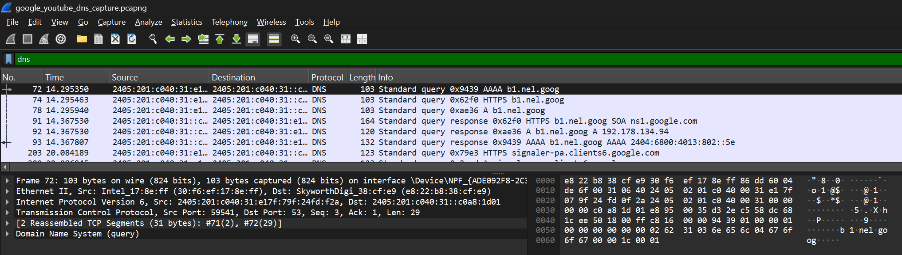
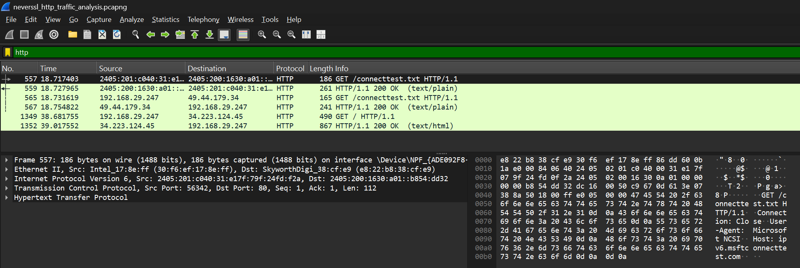
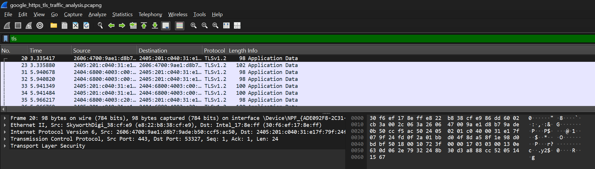

<<<<<<< HEAD
# Wireshark Network Traffic Analysis

## Overview
This project demonstrates basic network traffic analysis using Wireshark.

Different types of network traffic were captured and analyzed, including:
- DNS traffic
- HTTP traffic
- HTTPS/TLS encrypted traffic

The objective of this project was to understand how network communication works and how packet analysis is performed in cybersecurity investigations.

---

## Tools Used
- Wireshark
- Windows OS

---

## Project Structure

- captures/ -> packet capture files
- screenshots/ -> Wireshark analysis screenshots
- report/ -> project report documentation

---

## Traffic Analysis

### 1. DNS Traffic Analysis
File:
`google_youtube_dns_capture.pcapng`

Observations:
- DNS queries and responses were captured
- Domain names were translated into IP addresses
- Google and YouTube traffic generated DNS packets

---

### 2. HTTP Traffic Analysis
File:
`neverssl_http_traffic_analysis.pcapng`

Observations:
- HTTP traffic was visible in plaintext
- GET requests and headers could be inspected
- Host and User-Agent information were readable

---

### 3. HTTPS/TLS Traffic Analysis
File:
`google_https_tls_traffic_analysis.pcapng`

Observations:
- TLS traffic was encrypted
- Application data could not be read directly
- HTTPS provided secure communication

---

## Key Learnings
- Learned packet capture using Wireshark
- Understood DNS query/response behavior
- Compared HTTP and HTTPS traffic
- Identified encrypted TLS communication
- Practiced protocol filtering in Wireshark

---

## Screenshots

### DNS Traffic Analysis

### HTTP Traffic Analysis

### TLS Encrypted Traffic

---

## Conclusion
This project helped build foundational cybersecurity and network traffic analysis skills using Wireshark. It provided practical experience in packet inspection, protocol filtering, and understanding encrypted versus unencrypted network communication.

---

## Author
Meghana Palagani
=======
# wireshark-network-analysis
>>>>>>> 369153f8869581dc1a524e8e66a504fa76a73791
